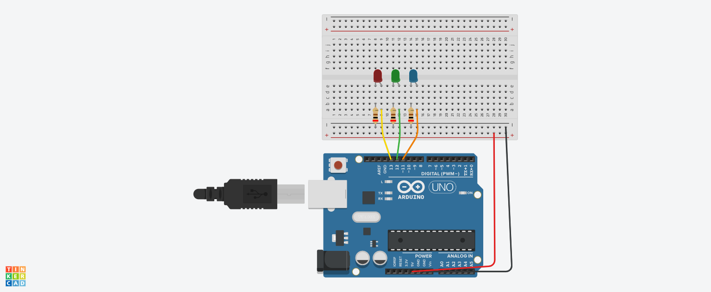
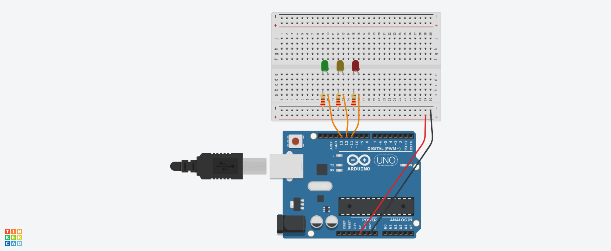

# IoT-Codes-Arduino
Códigos de Arduino de las practicas de laboratorio de IoT

## RGB
### Practica:
* Este archivo configura tres pines de Arduino para controlar un LED RGB (rojo, verde y azul) mediante salidas analógicas. Define los pines rojo, azul y verde como salidas y los inicializa con un valor de 0 en el bucle principal (loop), lo que significa que los tres colores están apagados. Sin embargo, no hay lógica adicional para cambiar los valores de los colores, por lo que solo configura el LED y lo apaga inicialmente​(RGB). *

### Componentes:
- Arduino UNO.
- LEDs individuales (uno rojo, uno verde, y uno azul).
- Resistencias de 220Ω (una para cada LED).
- Cables de conexión.

### Conexiones:
1. Identifica las patas del LED individual:
    - Ánodo (positivo): La pata más larga del LED, que conectaremos al pin de Arduino a través de una resistencia.
    - Cátodo (negativo): La pata más corta del LED, que conectaremos al GND.
2. Conexiones para cada LED:
    - LED Rojo:
        - Conecta el ánodo del LED a una resistencia de 220Ω y luego al pin digital PWM 9 de Arduino.
        - Conecta el cátodo directamente al GND de Arduino.
    - LED Verde:
        - Conecta el ánodo del LED a una resistencia de 220Ω y luego al pin PWM 10 de Arduino.
        - Conecta el cátodo al GND.
    - LED Azul:
        - Conecta el ánodo del LED a una resistencia de 220Ω y luego al pin PWM 11 de Arduino.
        - Conecta el cátodo al GND.

## SEMAFORO
### Practica: 
Este archivo contiene el código para simular el funcionamiento de un semáforo. Define tres pines para los LEDs de los colores típicos de un semáforo: verde, amarillo y rojo. En el loop, el código controla los LEDs para simular una secuencia de luces: Enciende el rojo durante 6 segundos. Enciende el verde durante 3 segundos, seguido de un parpadeo (encendido y apagado rápido). Enciende el amarillo durante 2 segundos con un parpadeo similar antes de cambiar. Esta secuencia se repite, simulando el ciclo de un semáforo de tráfico básico​(SEMAFORO).

### Componentes:
- Arduino UNO.
- LEDs individuales (uno rojo, uno amarillo, y uno verde).
- Resistencias de 220Ω (una para cada LED).
- Cables de conexión.

### Conexiones:
1. Identifica las patas del LED individual:
    - Ánodo (positivo): La pata más larga del LED, que conectaremos al pin de Arduino a través de una resistencia.
    - Cátodo (negativo): La pata más corta del LED, que conectaremos al GND.
2. Conexiones para cada LED:
    - LED Rojo:
        - Conecta el ánodo del LED a una resistencia de 220Ω y luego al pin digital PWM 9 de Arduino.
        - Conecta el cátodo directamente al GND de Arduino.
    - LED amarillo:
        - Conecta el ánodo del LED a una resistencia de 220Ω y luego al pin PWM 10 de Arduino.
        - Conecta el cátodo al GND.
    - LED verde:
        - Conecta el ánodo del LED a una resistencia de 220Ω y luego al pin PWM 11 de Arduino.
        - Conecta el cátodo al GND.

## Arduino con sensor ultrasónico
### Practica:
Este código utiliza un sensor ultrasónico para medir la distancia a un objeto y realizar alguna acción basada en esa distancia. El sensor envía una señal de sonido y mide el tiempo que tarda en regresar después de rebotar en un objeto. La distancia se calcula y puede mostrarse en el monitor serial o utilizarse para activar LEDs u otros componentes según el rango de distancia detectado.

### Componentes:
- Arduino UNO.
- Sensor ultrasónico HC-SR04.
- LEDs: rojo, amarillo, verde.
- Resistencias de 220Ω (una por LED).
- Protoboard y cables de conexión.

### Conexiones:
1. Sensor HC-SR04
    - VCC: Conecta al pin de 5V del Arduino.
    - GND: Conecta al GND del Arduino.
    - Trig: Conecta al pin digital 9.
    - Echo: Conecta al pin digital 10.
1. LEDs
    - LED Rojo:
        1. Ánodo -> Pin 6 (a través de una resistencia).
        2. Cátodo -> GND.
    - LED Amarillo:
        1. Ánodo -> Pin 5 (a través de una resistencia).
        2. Cátodo -> GND.
    - LED Verde:
        1. Ánodo -> Pin 4 (a través de una resistencia).
        2. Cátodo -> GND.

## Arduino con sensor ultrasónico y pantalla LCD
### Practica:
En esta configuración, el Arduino mide la distancia usando un sensor ultrasónico y luego muestra el valor de distancia en una pantalla LCD. Esto es útil en proyectos donde se necesita visualizar la distancia detectada, como en sistemas de aparcamiento o robots de evitación de obstáculos.

### Componentes:
- Sensor ultrasónico HC-SR04
- Pantalla LCD 16x2 I2C
- Arduino UNO
- Cables jumper
- Protoboard

### Conexiones:
1. Sensor ultrasónico HC-SR04:
    - VCC → Conecta a 5V.
    - GND → Conecta a GND.
    - Trig → Conecta al pin digital D8.
    - Echo → Conecta al pin digital D9.
2. LCD 16x2 I2C:
    - VCC → Conecta a 5V.
    - GND → Conecta a GND.
    - SDA → Conecta al pin A4 (Arduino UNO).
    - SCL → Conecta al pin A5 (Arduino UNO).

## Arduino con sensor LDR
### Practica:
Este código utiliza un sensor LDR para medir la luz ambiental. A partir de la lectura del LDR, el Arduino puede controlar otros dispositivos (por ejemplo, encender o apagar LEDs) en función del nivel de luz detectado. Es una configuración sencilla, útil para proyectos de ahorro de energía o alarmas de luz.

### Componentes:
- Arduino UNO.
- Fotorresistor (LDR).
- Resistencia de 10kΩ (divisor de voltaje para el LDR).
- Protoboard y cables de conexión.

### Conexiones:
1. Conexiones del LDR
    - Conecta un extremo del LDR a 5V.
    - Conecta el otro extremo a una resistencia de 10 kΩ y al pin analógico A0 del Arduino:
        - La resistencia de 10 kΩ se conecta a GND.
        - Esto crea un divisor de voltaje que permite leer el valor analógico del LDR en el pin A0.
2. Conexiones del LCD (I2C)
    - VCC → 5V.
    - GND → GND.
    - SDA → A4 (Arduino UNO).
    - SCL → A5 (Arduino UNO).

## Arduino con sensor LDR y pantalla LCD
### Practica:
Este archivo configura un sensor LDR (fotorresistor) y una pantalla LCD. El LDR mide la intensidad de luz ambiental y el valor capturado se muestra en la pantalla LCD. Esto permite monitorear los cambios en la luz y visualizarlos en tiempo real en la pantalla, ideal para sistemas de control de iluminación o monitoreo ambiental.

### Componentes:
- Arduino UNO.
- Fotorresistor (LDR).
- Resistencia de 10kΩ (divisor de voltaje para el LDR).
- Pantalla LCD 16x2 con interfaz I2C (o sin I2C, ajustando el código).
- Protoboard y cables de conexión.

### Conexiones:
1. LDR (Fotorresistor)
* El LDR se usa en un divisor de voltaje con una resistencia de 10kΩ para medir la intensidad de luz como voltaje analógico: *
    - Un extremo del LDR conecta a 5V.
    - El otro extremo del LDR conecta:
        - Al pin A0 del Arduino (entrada analógica).
        - un extremo de la resistencia de 10kΩ.
    - El otro extremo de la resistencia conecta a GND.
2. LCD 16x2 con I2C
    - VCC: Conecta al pin de 5V del Arduino.
    - GND: Conecta a GND del Arduino.
    - SDA: Conecta al pin A4 del Arduino (en placas UNO).
    - SCL: Conecta al pin A5 del Arduino (en placas UNO).

## Arduino con sensor DHT11
### Practica:
En este archivo, se utiliza un sensor DHT11 para capturar datos de temperatura y humedad. El DHT11 se conecta al Arduino y proporciona lecturas en tiempo real de las condiciones ambientales, que pueden mostrarse en el monitor serial o almacenarse para análisis posterior. Este tipo de sistema es útil en proyectos de monitoreo climático o domótica.

### Componentes:
- Arduino UNO
- DHT11 Sensor
- Resistencia de 10 kΩ
- Protoboard y cables jumper

### Conexiones:
1. DHT11 Sensor:
    - VCC → Conecta a 5V del Arduino.
    - GND → Conecta a GND del Arduino.
    - Data (Salida) → Conecta al pin digital D2 del Arduino.
    - Conecta una resistencia de 10 kΩ entre VCC y Data (pull-up).

## Arduino con comunicación serial
### Practica:
Este archivo configura el puerto serial del Arduino para enviar y recibir datos desde una computadora u otro dispositivo. La comunicación serial permite monitorear variables, depurar el código o controlar el Arduino desde un software externo. Es una herramienta versátil para enviar datos de sensores y recibir comandos de control.

### Componentes:
- Arduino UNO.
- LED.
- Resistencias de 220Ω.
- Cables de conexión.

### Conexiones:
1. LED:
    - Conecta el cátodo (patita corta) del LED a GND.
    - Conecta el ánodo (patita larga) a un extremo de una resistencia de 220 Ω.
    - Conecta el otro extremo de la resistencia al pin digital D9 del Arduino.